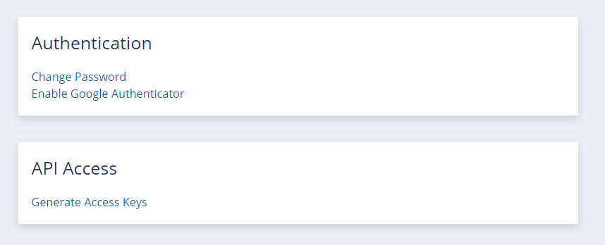
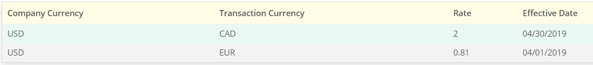

# RightsLine API Transition from V2 to V3 

*Date Created: 12/12/2019*

Change is hard... But we think you'll really love what we've done!  

We have released a new version of the RightsLine public API, aptly titled V3.
V3 was designed to increase security and flexibility of the API compared to the previous version, V2.  

#### Differences between V2 and V3 include:

- Utilizing Amazon AWS Authentication instead of Basic Authentication to authorize requests.
- Standard ISO-8601 date formats.
- List-of-Value fields represented as objects instead of strings.
- API Search responses contain total count of objects found.
- Money data types are represented as objects.

If you are currently using V2 of RightsLine's public API and would like to transition to V3, please follow the steps listed below:

#### Steps to transition from RightsLine API V2 to V3
1. Modify requests to use [Amazon AWS Authentication](#amazon-aws-authentication).
2. [Convert date fields](#convert-date-fields) to ISO format.
3. [Convert List-of-Value (LOV) fields](#convert-list-of-value-lov-fields) to JSON objects, or an array of JSON objects.
4. [Convert search responses](#convert-search-responses) to new format.
5. [Convert money data](#convert-money-data-type-to-object) to JSON objects.

## Amazon AWS Authentication

With the introduction of V3 of our public API, we have transitioned to using Amazon AWS Authentication to sign all requests.  The credentials that you will need to pass with your requests will look a bit different.

#### Generating Access Keys

Start by generating your API Access Keys:

1. **Contact your RightsLine representative** for your organization's *V3 API Key*.
2. **Login to your user account** from https://admin.rightsline.com.
3. Open your **Profile** from the drop-down menu, and in the *API Access* module, click **Generate Access Keys**.



> **Note:** You will use these keys to request temporary access keys to authenticate to the API.  These keys are private.  Please store them securely.

#### Requesting Temporary Credentials

Use the `API Key`, `Access Key`, and `Secret Access Key` to request your temporary API credentials.  The request will look like:

``` json 
POST /v3/auth/temporary-credentials
Accept: application/json
Content-Type: application/json
x-api-key: YOUR_API_KEY
Body:
{
 "accessKey":"YOUR_ACCESS_KEY",
 "secretKey":"YOUR_SECRET_ACCESS_KEY"
}
```
A successful response:
``` json 
HTTP/1.1 200 OK
Body:
{
"accessKey": "***********",
"secretKey": "***************************",
"sessionToken": "FQoDYXd//////====ONCXz6OZC6FIxoWO1CGxVkwnY6WT07ZdLgGkr5ZkRCnGpa5uiF5KKbgMMWyQjKIazeyarBvXleDQmJznO4tBKq3U709cY20lVkdzHwAJQ5HXWHVop6w6cRy8uyOFPZ9fPD79PJ0L9KUkSo9uIG8DUK7PRvs4eAtIQQFdW+j2eHx6sUlF====34098qojfaof",
"expiration": "2018-01-01T00:00:01+00:00"
}
```

The credentials that you receive in the response will be used for all subsequent requests to the RightsLine API.  These credentials have an expiration of 1 hour after they are requested.  Once these credentials expire, you will need request another set of credentials.

#### Making a Request

Requests to the API will now include the following headers:

- `X-Api-Key` - Your organization's V3 API Key
- `X-Amz-Security-Token` - The "sessionToken" from the response in the previous step.
- `X-Amz-Date` - The ISO-8601 formatted date and time of the request. ex. 20190124T015900Z
- `Authorization` - The AWS Signature Version 4 authorization token.  To generate the authorization token, see: https://docs.aws.amazon.com/general/latest/gr/sigv4_signing.html

A sample request to create a new catalog-item:

``` json
POST /v3/catalog-item
X-Api-Key: YOUR_API_KEY
X-Amz-Security-Token: FQoDYXd//////====ONCXz6OZC6FIxoWO1CGxVkwnY6WT07ZdLgGkr5ZkRCnGpa5uiF5KKbgMMWyQjKIazeyarBvXleDQmJznO4tBKq3U709cY20lVkdzHwAJQ5HXWHVop6w6cRy8uyOFPZ9fPD79PJ0L9KUkSo9uIG8DUK7PRvs4eAtIQQFdW+j2eHx6sUlF====34098qojfaof
X-Amz-Date: 20190124T015900Z
Authorization: AWS4-HMAC-SHA256 Credential=*******************/20191212/us-east-1/execute-api/aws4_request, SignedHeaders=host;x-amz-date;x-amz-security-token;x-api-key, Signature=***************************************************
Body:
{
    "title": "TEST SEASON 99",
    "template": {
        "templateId": 11,
        "templateName": "Season"
    },
    "status": {
        "statusId": 1,
        "statusName": "Active"
    }
}
```

[top](#rightsline-api-transition-from-v2-to-v3)

## Convert Date Fields

All date fields are now in UTC and represented in Standard ISO-8601 format.  

For example, `September 21, 2019 04:53:23 PM` is represented as `20190921T165323Z`.

[top](#rightsline-api-transition-from-v2-to-v3)

## Convert List-of-Value (LOV) Fields

Fields/Characteristics whose values are a subset from a possible list of values are now respresented as objects, rather than strings.

Consider a field for a Movie called Genre, which holds the genre of the movie.  A movie can be categorized in several different genres, and has a list of possible values (Comedy, Drama, Documentary, etc.).

In V2, the value of this field would be represented as a pipe-delimited list of strings:

``` json
"characteristics":{
    "genre": "Action|Adventure|Comedy|Drama"
}
```

In V3, the value of the characteristic is represented either as a single object, or an array of objects:

``` json
"characteristics":{
    "genre": [
      {
        "id": 2,
        "value": "Action"
      },
      {
        "id": 3,
        "value": "Adventure"
      },
      {
        "id": 7,
        "value": "Comedy"
      },
      {
        "id": 11,
        "value": "Drama"
      }
    ]
}
```

The object has the following structure:
``` yaml
LOVfield:
    id: Unique ID of the value:Integer,
    value: The string representation of the value:String,
    xref: optional
```

When creating/updating an LOV field, it is possible to reference the value either by ID, string value, or xref value.
    
[top](#rightsline-api-transition-from-v2-to-v3)

## Convert Search Responses

Responses to requests to any search endpoints on the RightsLine API have a new format.  The new search response format is:

``` yaml
SearchResponse:
    numFound: count_of_entities_found:Integer,
    entities: entities_found:Object[]
```

An example response for a search request:

``` json
{
    "numFound": 2,
    "entities": [
        {
            "id":21224047,
            "parentURL":"https://api-staging.rightsline.com/v2/catalog-item/123",
            "childURL":"https://api-staging.rightsline.com/v2/rightset/111",
            "relationshipType":{
                "relationshipTypeId":0,
                "relationshipTypeName":"Default"
            },
            "createdById":12345,
            "createdDate":"2017-09-25T16:00:55.317Z",
            "lastUpdatedById":12345,
            "lastUpdatedDate":"2017-09-25T16:00:55.317Z"
        },
        {
            "id":23711944,
            "parentURL":"https://api-staging.rightsline.com/v2/catalog-item/123",
            "childURL":"https://api-staging.rightsline.com/v2/rightset/222",
            "relationshipType":{
                "relationshipTypeId":0,
                "relationshipTypeName":"Default"
            },
            "createdById":12345,
            "createdDate":"2018-01-17T17:31:06.753Z",
            "lastUpdatedById":12345,
            "lastUpdatedDate":"2018-01-17T17:31:06.753Z"
        }
    ]
}
```

[top](#rightsline-api-transition-from-v2-to-v3)

## Convert Money Data Type to Object

All `money` data types will be represented as a JSON object in V3.  

An example of a money data type:

``` json
"amount": {
    "locAmt": "400.00",
    "locCur": 1,
    "locSym": "USD",
    "divAmt": "400.00",
    "divCur": 1,
    "divSym": "USD"
}
```

The `locCur`, `locSym`, `divCur`, and `divSym` are the IDs and Values from your configured currency List-of-Values.  If you want the currency conversion tables that have been configured to convert a local currency into your company's currency, you should only supply the locAmt, locCur, and locSym values and the divAmt will be auto calculated based on the effective conversation rate you have configured.

To configure currency conversions, go to **Administration** and click on **Currency** in the *Company Settings* section.



[top](#rightsline-api-transition-from-v2-to-v3)

